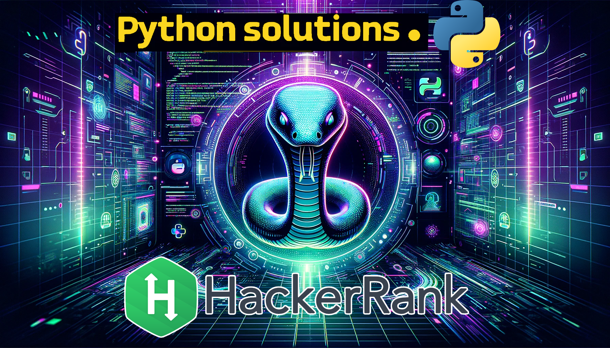

# HackerPython :snake:

Bienvenido a **HackerPython**, el repositorio dedicado a resolver todos los retos de programación de HackerRank utilizando Python. Aquí encontrarás soluciones estructuradas por niveles de dificultad: fácil, intermedio y difícil. Este proyecto tiene como objetivo no solo mejorar tus habilidades de codificación, sino también ofrecer un recurso de aprendizaje para aquellos interesados en profundizar en el mundo de la programación con Python.

## :book: Cómo usar este repositorio

Este repositorio está organizado en tres carpetas principales, correspondientes a los niveles de dificultad de los desafíos en HackerRank:

- **Fácil**
- **Intermedio**
- **Difícil**

Dentro de cada carpeta, encontrarás los scripts correspondientes a los desafíos, junto con una breve descripción y explicación de la solución.

## :wrench: Instalación

Para ejecutar los scripts de este repositorio, es recomendable crear un entorno virtual e instalar las dependencias necesarias:

python -m venv venv
source venv/bin/activate # En Windows use venv\Scripts\activate
pip install -r requirements.txt

## :bulb: Contribuir

¿Interesado en contribuir? ¡Genial! Nos encantaría recibir tus soluciones para desafíos que aún no están en este repositorio. Por favor, consulta nuestras [guías de contribución](CONTRIBUTING.md) para más información sobre cómo hacerlo.

## :memo: Licencia

Este proyecto está bajo la Licencia MIT. Consulta el archivo [LICENSE](LICENSE.md) para más detalles.

## :🙋‍♂️: Soporte

Si tienes alguna pregunta o necesitas ayuda, no dudes en abrir un issue o contactarme directamente a través de [LinkedIn](https://www.linkedin.com/in/javier-perez-780145263/).

---
## Agradecimientos

A todos los que contribuyen, usan y aprenden con este proyecto, ¡gracias!

---

## Sobre Mí 🚀

Hola, soy Javier Perez 👋

Desarrollador de Software con pasión por Python, Django, Flask, C#, Docker, HTML, CSS, Unity, SQL, PostgreSQL, MySQL.

- 🔭 Actualmente estoy trabajando como freelance y en proyectos personales.
- 🌱 Constantemente aprendiendo sobre nuevas tecnologías y mejores prácticas.
- 🤝 Busco colaborar en proyectos interesantes y desafiantes.
- 💬 Pregúntame sobre Python, Django, Flask, C#, Docker, HTML, CSS, Unity, SQL, PostgreSQL, MySQL.
- 📫 Cómo contactarme: [playgames.j.g17@gmail.com](mailto:playgames.j.g17@gmail.com)

¡Feliz codificación! :heart:
